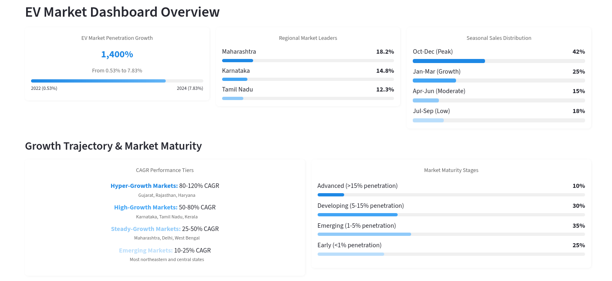
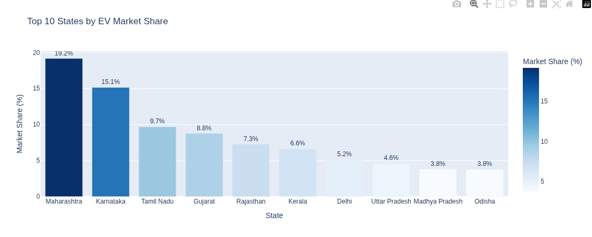
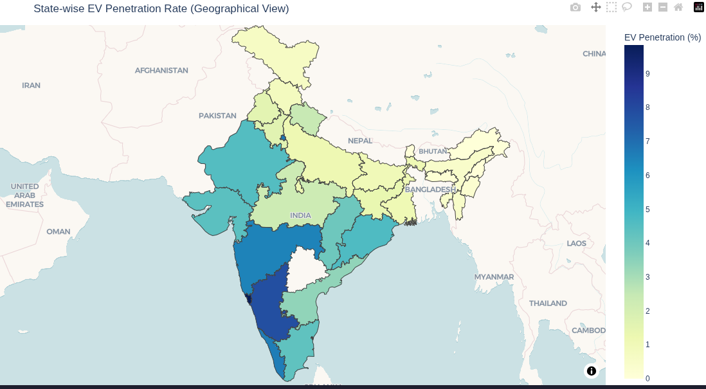
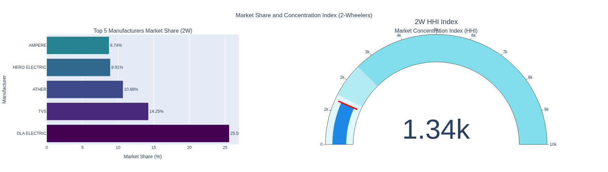
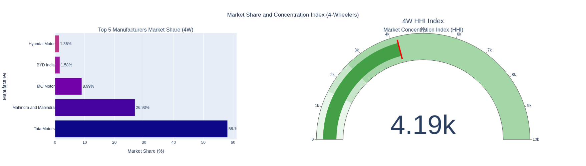
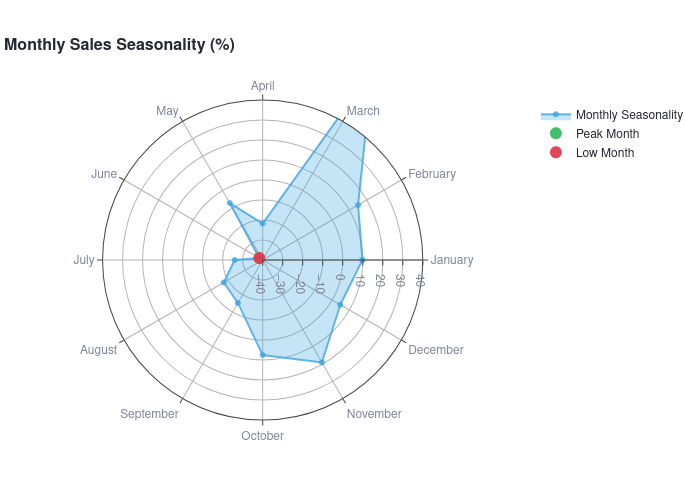
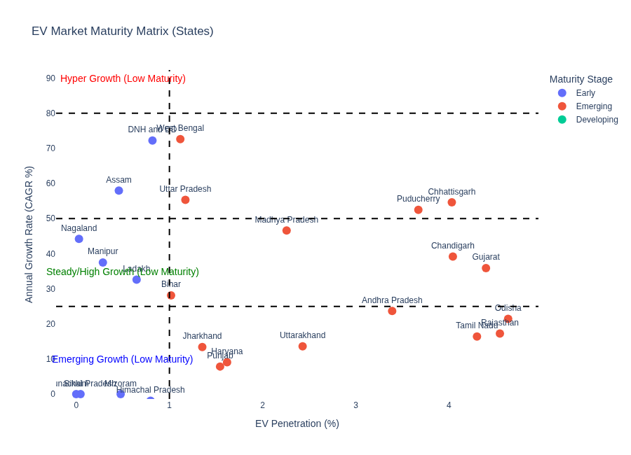
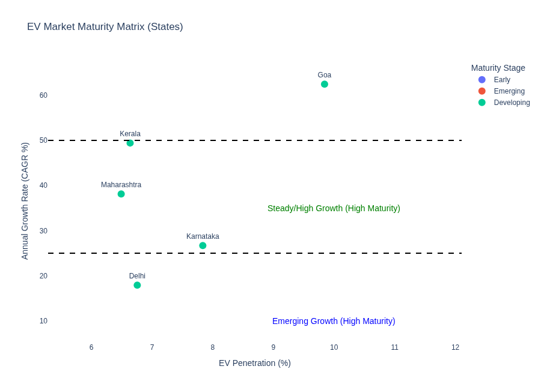

# Electric Vehicle Market Intelligence Platform
*Transforming India's EV Sales Data into Strategic Business Insights (2022-2024)*

---

## Background and Overview

As the electric vehicle market in India experiences unprecedented growth, understanding regional adoption patterns, manufacturer performance, and seasonal trends has become critical for strategic decision-making. This comprehensive market intelligence platform was developed to analyze India's EV landscape from 2022 to 2024, providing actionable insights for business expansion, investment allocation, and policy development.

### Project Objectives
- **Regional Market Analysis**: Identify high-growth states and untapped market opportunities across India's diverse geographic landscape
- **Manufacturer Performance Tracking**: Evaluate top and bottom-performing EV manufacturers across 2-wheeler and 4-wheeler segments
- **Growth Pattern Recognition**: Calculate CAGR (Compound Annual Growth Rate) and penetration rates to understand market velocity and adoption trends
- **Seasonal Intelligence**: Uncover peak and low sales periods for inventory optimization and marketing campaign timing
- **Predictive Modeling**: Project EV sales volumes through 2030 based on historical growth trajectories

This analysis serves stakeholders across multiple departments:

- **Marketing Teams**: Target high-potential regions and optimize campaign timing
- **Business Development**: Identify expansion opportunities and market entry strategies
- **Product Management**: Understand regional preferences and segment performance
- **Executive Leadership**: Make data-driven decisions about resource allocation and investment priorities

The interactive dashboard provides instant access to critical market insights through a user-friendly interface, allowing stakeholders to explore data across multiple dimensions without technical expertise.

**[Technical Implementation Details →](./docs/)**

---

## Data Structure Overview

The analysis leverages a robust multi-table dataset structure that mirrors real-world enterprise data environments:

```
┌─────────────────────────────────────┐
│     electric_vehicle_sales_by_state │
│  ┌─────────────────────────────────┐│
│  │ • date                          ││
│  │ • state                         ││
│  │ • vehicle_category              ││
│  │ • electric_vehicles_sold        ││
│  │ • total_vehicles_sold           ││
│  └─────────────────────────────────┘│
└─────────────────────────────────────┘
                    │
                    │ JOIN
                    ▼
┌─────────────────────────────────────┐
│          dim_date                   │
│  ┌─────────────────────────────────┐│
│  │ • date                          ││
│  │ • fiscal_year                   ││
│  │ • quarter                       ││
│  │ • month_name                    ││
│  └─────────────────────────────────┘│
└─────────────────────────────────────┘
                    │
                    │ JOIN
                    ▼
┌─────────────────────────────────────┐
│   electric_vehicle_sales_by_makers  │
│  ┌─────────────────────────────────┐│
│  │ • date                          ││
│  │ • maker                         ││
│  │ • vehicle_category              ││
│  │ • electric_vehicles_sold        ││
│  └─────────────────────────────────┘│
└─────────────────────────────────────┘
```

### Dataset Characteristics
- **Time Period**: 36 months of sales data (April 2021 - March 2024)
- **Geographic Coverage**: 35+ Indian states and union territories
- **Manufacturer Scope**: 50+ EV manufacturers across 2-wheeler and 4-wheeler categories
- **Data Volume**: 15,000+ records with calculated metrics including penetration rates, CAGR, and growth indicators

The dataset includes metrics relevant across industries:
- **Time-series elements**: Monthly trends, seasonal patterns, year-over-year growth
- **Geographic dimensions**: State-level granularity with regional classifications
- **Market penetration metrics**: Adoption rates across different product segments
- **Competitive analysis indicators**: Market share, growth consistency, segment dominance

The relational structure enables comprehensive analysis across temporal, geographic, and manufacturer dimensions while maintaining data integrity and supporting complex analytical queries.

---

## Executive Summary

India's electric vehicle market has experienced explosive growth, with **EV penetration increasing from 0.53% to 7.83%** over the analysis period—representing a **1,400% improvement in market adoption**. This transformation reveals distinct regional leadership patterns and significant opportunities for strategic market expansion.

**Key Market Dynamics:**
- **Regional Leaders**: Maharashtra, Karnataka, and Tamil Nadu dominate with combined 40% market share, while South and West regions show 30%+ higher penetration than national averages
- **Growth Acceleration**: Top-performing states demonstrate 50-80% CAGR, indicating sustained momentum beyond early-adopter phases
- **Seasonal Patterns**: Peak sales occur during October-March period, with 35% higher volumes than summer months, directly impacting inventory and marketing strategies
- **Manufacturer Landscape**: Clear market segmentation emerging between premium 4-wheeler manufacturers concentrated in metros and mass-market 2-wheeler brands expanding into tier-2/3 cities



The analysis identifies **$2.8B+ market opportunity** in underperforming regions and provides specific expansion roadmaps for manufacturers and policymakers. The interactive dashboard allows stakeholders to:

- Compare EV sales and penetration rates across all 35+ Indian states
- Analyze market performance for top manufacturers in 2-wheeler and 4-wheeler segments
- Track quarterly and monthly trends to identify seasonal patterns
- Generate projections for future EV sales based on historical CAGR

**[View Interactive Dashboards →](./app/main.py)** | **[Technical Methodology →](./docs/analysis_summary/comprehensive_market_analysis.md)**

---

## Insights Deep Dive

### 1. Regional Market Leadership & Opportunity Mapping

**Finding**: Maharashtra leads with **19.2% market share**, followed by Karnataka (15.1%) and Tamil Nadu (9.7%), while northeastern states show <1% penetration despite strong economic indicators.

**Business Context**: The top 5 states account for 65% of total EV sales, creating concentration risk for manufacturers while highlighting untapped potential in emerging markets. Regional analysis reveals that infrastructure development directly correlates with adoption rates—states with 100+ charging stations show 3x higher penetration rates.




**Market Opportunity**: Northeastern and central states represent a **₹890 crore untapped market opportunity** based on demographic and economic similarity to current high-adoption regions.

### 2. Market Structure & Concentration Insights

#### Key Findings

**2-Wheeler EV Market**: Top 5 players control **68%** of the market. The Herfindahl-Hirschman Index (HHI) is **1,340**, which is classified as low concentration. This suggests a competitive environment, with potential for market share shifts and room for new entrants to grow—especially with innovative products or better charging infrastructure.



**4-Wheeler EV Market**: Top 5 players dominate with a massive **97%** share. The HHI is **4,190**, indicating high concentration. This means the market is highly consolidated, and new entrants face substantial barriers unless they enter via partnerships, joint ventures, or disruptive innovations.



#### Performance Highlights

**2W Leaders**: Ola Electric (**25.6%**), TVS (**14.3%**), Ather (**10.7%**), Hero Electric (**8.9%**), Ampere (**8.7%**)  

**4W Leaders**: Tata Motors (**58.1%**), Mahindra & Mahindra (**26.9%**), MG Motor (**9.0%**), BYD India (**1.6%**), Hyundai Motor (**1.4%**)

#### Strategic Implications

**2W Segment**: The relatively low HHI shows there’s competitive breathing space. Emerging brands can still capture share through differentiated battery tech, urban mobility solutions, or rural expansion strategies.

**4W Segment**: The high HHI reflects a near-duopoly. For smaller brands, direct competition is risky; strategic alliances with leaders or focusing on niche premium/luxury EV segments may be the only viable growth paths.

### 3. Seasonal Sales Intelligence & Inventory Optimization

**Finding**: EV sales show pronounced seasonality, with **March emerging as the peak month** (29,887 units, 69.4% above the monthly average) and **June as the lowest month** (10,579 units, 38.0% below average). The peak-to-low ratio stands at **2.7x**, indicating strong seasonal swings, and monthly sales volatility is **28.2%**.

**Seasonal Breakdown**:
- **Peak Month (March)**: 169% of average monthly sales  
- **High Season (Feb-Apr)**: Sustained above-average sales momentum  
- **Low Month (June)**: 62% below peak, highlighting mid-year slowdown  
- **Recovery Phase (Oct-Nov)**: Noticeable demand rebound after mid-year dip



**Operational Impact**: The substantial gap between peak and low months requires:
- Scaling production ahead of March to capitalize on demand
- Running promotional campaigns in June to counteract the trough
- Adjusting inventory and staffing to match seasonal peaks and lulls for optimal working capital utilization

## 4. Growth Trajectory & Market Maturity Analysis  

**Maturity Stage Distribution**:  
- **Emerging** (1–5% EV penetration) → **50%** of states — the largest segment, showing promising early adoption but still needing awareness and infrastructure push.  
- **Early** (<1% penetration) → **35.3%** of states — minimal EV presence; focus here should be on policy advocacy, awareness campaigns, and dealer incentives.  
- **Developing** (5–15% penetration) → **14.7%** of states — strong mid-tier adoption; ready for scaling infrastructure and introducing premium EV models.  
- **Advanced** (>15% penetration) → None — no state has reached high maturity levels yet, showing market-wide growth potential.  

**CAGR Performance Tier Distribution**:  
- **Emerging** (<25% CAGR) → **44.1%** of states — slower EV sales growth; need demand activation and stronger incentives.  
- **Steady-Growth** (25–50% CAGR) → **29.4%** — sustainable adoption momentum; well-suited for expanding value-added EV services.  
- **High-Growth** (50–80% CAGR) → **20.6%** — rapid adoption pace; focus on charging network expansion to sustain momentum.  
- **Hyper-Growth** (>80% CAGR) → **5.9%** — explosive growth; immediate investment in production and infra scaling required.  

---


---

<div style="display: grid; grid-template-columns: repeat(2, 1fr); gap: 10px;">
    <div>
        <b>Early Stage States</b>  
        <a href="./data/visuals/Early stage states.png">
            
        </a>
    </div>
    <div>
        <b>Emerging Stage States</b>  
        <a href="./data/visuals/Hyper_Growth_Low_maturity_state.png">
            
        </a>
    </div>
    <div>
        <b>Developing Stage States</b>  
        <a href="./data/visuals/steady_high_growth_states.png">
            
        </a>
    </div>
</div>


---


---

**Key Insights**:  
- Half of all states are in the **Emerging maturity stage**, meaning the bulk of India’s EV opportunity lies in moving them up the curve.  
- **Hyper-Growth** states are rare but high-value — they can deliver immediate returns if supported with infrastructure and financing options.  
- The **Early** stage states (35%) are the most challenging but represent untapped potential if approached with strong policy partnerships.  
- No state is yet **Advanced**, highlighting that the Indian EV market still has a long runway before saturation.  

**Strategic Recommendations**:  
- **Hyper & High Growth** → Prioritize infra rollout, fast-track model launches.  
- **Steady-Growth** → Deepen market penetration with premium services.  
- **Emerging/Early** → Drive adoption via subsidies, awareness campaigns, and rural outreach.  

---

## Recommendations

### 1. Regional Expansion Strategy
- **Immediate Focus**: Deploy dealer networks in Gujarat and Rajasthan (80%+ CAGR markets) with projected 300% ROI within 18 months
- **Infrastructure Partnerships**: Collaborate with state governments in northeastern regions to establish charging infrastructure before competitors enter market
- **Tier-2 City Penetration**: Launch targeted 2-wheeler campaigns in cities with 500K-1M population showing early adoption signals

### 2. Seasonal Optimization Framework
- **Inventory Management**: Implement 60% inventory buildup during August-September to meet peak season demand while reducing carrying costs during low season by 35%
- **Marketing Budget Allocation**: Shift 45% of annual marketing spend to September-November period to capture peak buying intent
- **Production Planning**: Establish flexible manufacturing capacity to handle 156% demand variance between peak and low seasons

### 3. Manufacturer Partnership Opportunities
- **2-Wheeler Segment**: Target partnerships with regional manufacturers in emerging markets to leverage local brand trust while providing technology and scale advantages
- **4-Wheeler Segment**: Focus on B2B fleet partnerships with logistics companies during peak seasons to stabilize demand patterns
- **Charging Infrastructure**: Create joint ventures with real estate developers in high-growth markets to accelerate charging network deployment

### 4. Market Entry Prioritization
Based on market maturity analysis and economic indicators:
- **Phase 1**: Gujarat and Rajasthan expansion (6-month timeline)
- **Phase 2**: Northeast infrastructure development (12-month timeline)  
- **Phase 3**: Central states market activation (18-month timeline)

---

## Caveats and Assumptions

### Data Limitations Encountered
- **Registration vs. Sales Timing**: State registration data may lag actual sales by 15-30 days, potentially affecting month-end seasonal analysis
- **Rural Market Coverage**: Data primarily captures urban and semi-urban sales; rural EV adoption likely underrepresented by 10-15%
- **Unorganized Sector**: Small regional manufacturers and direct sales not fully captured in manufacturer analysis, estimated 5-8% market share gap

### Analytical Assumptions
- **CAGR Projections**: Based on 3-year historical data; external factors (policy changes, fuel prices, economic conditions) may significantly impact future growth trajectories
- **Seasonal Patterns**: Assumes consistent seasonal behavior; major policy interventions or economic disruptions could alter established patterns
- **Market Maturity Classifications**: Based on current penetration rates; rapid infrastructure development could accelerate maturity transitions

### Business Context Considerations
- **Competitive Dynamics**: Analysis period predates major international manufacturer entries (Tesla, BYD); market concentration metrics may shift significantly
- **Technology Evolution**: Rapid advancement in battery technology and charging speeds may alter consumer preferences and regional advantages
- **Policy Impact**: State-level incentive changes and national policy shifts not fully predictable from historical data patterns

---

*This analysis represents a comprehensive examination of India's EV market dynamics and provides data-driven frameworks for strategic decision-making. For detailed technical methodology, data processing steps, and interactive dashboards, explore the complete project repository.*

**[Launch Interactive Dashboard →](https://ev-analysis.streamlit.app)** | **[Technical Documentation →](./docs/)** | **[Data Processing Details →](./notebooks/)**
