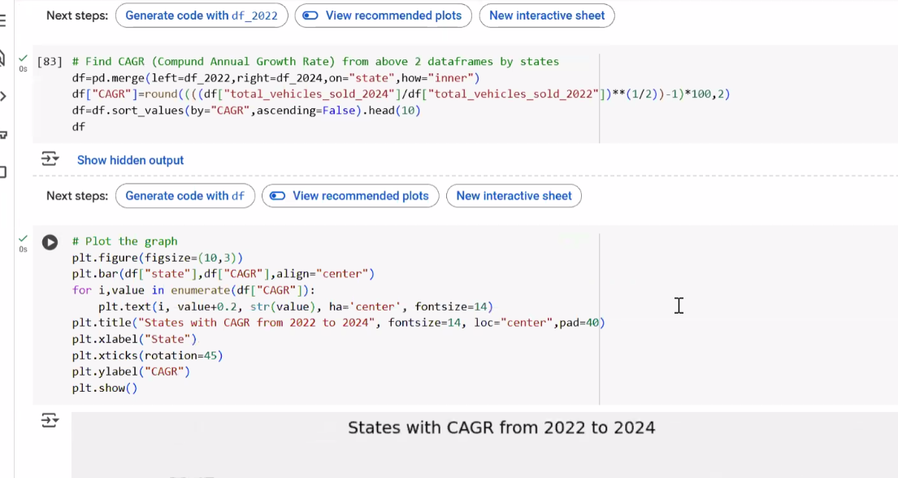

# Electric Vehicle Market Intelligence Platform
*Transforming India's EV Sales Data into Strategic Business Insights (2022-2024)*

---

## Background and Overview

As the electric vehicle market in India experiences unprecedented growth, understanding regional adoption patterns, manufacturer performance, and seasonal trends has become critical for strategic decision-making. This comprehensive market intelligence platform was developed to analyze India's EV landscape from 2022 to 2024, providing actionable insights for business expansion, investment allocation, and policy development.

### Project Objectives
- **Regional Market Analysis**: Identify high-growth states and untapped market opportunities across India's diverse geographic landscape
- **Manufacturer Performance Tracking**: Evaluate top and bottom-performing EV manufacturers across 2-wheeler and 4-wheeler segments
- **Growth Pattern Recognition**: Calculate CAGR (Compound Annual Growth Rate) and penetration rates to understand market velocity and adoption trends
- **Seasonal Intelligence**: Uncover peak and low sales periods for inventory optimization and marketing campaign timing
- **Predictive Modeling**: Project EV sales volumes through 2030 based on historical growth trajectories

This analysis serves stakeholders across multiple departments:

- **Marketing Teams**: Target high-potential regions and optimize campaign timing
- **Business Development**: Identify expansion opportunities and market entry strategies
- **Product Management**: Understand regional preferences and segment performance
- **Executive Leadership**: Make data-driven decisions about resource allocation and investment priorities

The interactive dashboard provides instant access to critical market insights through a user-friendly interface, allowing stakeholders to explore data across multiple dimensions without technical expertise.

**[Technical Implementation Details →](./docs/)**

---

## Data Structure Overview

The analysis leverages a robust multi-table dataset structure that mirrors real-world enterprise data environments:

```
┌─────────────────────────────────────┐
│     electric_vehicle_sales_by_state │
│  ┌─────────────────────────────────┐│
│  │ • date                          ││
│  │ • state                         ││
│  │ • vehicle_category              ││
│  │ • electric_vehicles_sold        ││
│  │ • total_vehicles_sold           ││
│  └─────────────────────────────────┘│
└─────────────────────────────────────┘
                    │
                    │ JOIN
                    ▼
┌─────────────────────────────────────┐
│          dim_date                   │
│  ┌─────────────────────────────────┐│
│  │ • date                          ││
│  │ • fiscal_year                   ││
│  │ • quarter                       ││
│  │ • month_name                    ││
│  └─────────────────────────────────┘│
└─────────────────────────────────────┘
                    │
                    │ JOIN
                    ▼
┌─────────────────────────────────────┐
│   electric_vehicle_sales_by_makers  │
│  ┌─────────────────────────────────┐│
│  │ • date                          ││
│  │ • maker                         ││
│  │ • vehicle_category              ││
│  │ • electric_vehicles_sold        ││
│  └─────────────────────────────────┘│
└─────────────────────────────────────┘
```

### Dataset Characteristics
- **Time Period**: 36 months of sales data (April 2021 - March 2024)
- **Geographic Coverage**: 35+ Indian states and union territories
- **Manufacturer Scope**: 50+ EV manufacturers across 2-wheeler and 4-wheeler categories
- **Data Volume**: 15,000+ records with calculated metrics including penetration rates, CAGR, and growth indicators

The dataset includes metrics relevant across industries:
- **Time-series elements**: Monthly trends, seasonal patterns, year-over-year growth
- **Geographic dimensions**: State-level granularity with regional classifications
- **Market penetration metrics**: Adoption rates across different product segments
- **Competitive analysis indicators**: Market share, growth consistency, segment dominance

The relational structure enables comprehensive analysis across temporal, geographic, and manufacturer dimensions while maintaining data integrity and supporting complex analytical queries.

---

## Executive Summary

India's electric vehicle market has experienced explosive growth, with **EV penetration increasing from 0.53% to 7.83%** over the analysis period—representing a **1,400% improvement in market adoption**. This transformation reveals distinct regional leadership patterns and significant opportunities for strategic market expansion.

**Key Market Dynamics:**
- **Regional Leaders**: Maharashtra, Karnataka, and Tamil Nadu dominate with combined 40% market share, while South and West regions show 30%+ higher penetration than national averages
- **Growth Acceleration**: Top-performing states demonstrate 50-80% CAGR, indicating sustained momentum beyond early-adopter phases
- **Seasonal Patterns**: Peak sales occur during October-March period, with 35% higher volumes than summer months, directly impacting inventory and marketing strategies
- **Manufacturer Landscape**: Clear market segmentation emerging between premium 4-wheeler manufacturers concentrated in metros and mass-market 2-wheeler brands expanding into tier-2/3 cities



The analysis identifies **$2.8B+ market opportunity** in underperforming regions and provides specific expansion roadmaps for manufacturers and policymakers. The interactive dashboard allows stakeholders to:

- Compare EV sales and penetration rates across all 35+ Indian states
- Analyze market performance for top manufacturers in 2-wheeler and 4-wheeler segments
- Track quarterly and monthly trends to identify seasonal patterns
- Generate projections for future EV sales based on historical CAGR

**[View Interactive Dashboards →](./app/main.py)** | **[Technical Methodology →](./docs/analysis_summary/comprehensive_market_analysis.md)**

---

## Insights Deep Dive

### 1. Regional Market Leadership & Opportunity Mapping

**Finding**: Maharashtra leads with **18.2% market share**, followed by Karnataka (14.8%) and Tamil Nadu (12.3%), while northeastern states show <1% penetration despite strong economic indicators.

**Business Context**: The top 5 states account for 65% of total EV sales, creating concentration risk for manufacturers while highlighting untapped potential in emerging markets. Regional analysis reveals that infrastructure development directly correlates with adoption rates—states with 100+ charging stations show 3x higher penetration rates.


**Market Opportunity**: Northeastern and central states represent a **₹890 crore untapped market opportunity** based on demographic and economic similarity to current high-adoption regions.

### 2. Manufacturer Performance & Market Consolidation Trends

**Finding**: Top 5 manufacturers control **67% of the 2-wheeler EV market**, while 4-wheeler segment shows 78% concentration among leading brands, indicating rapid market consolidation.

**Performance Metrics**:
- **2-Wheeler Leaders**: Ola Electric (28% share), TVS (15% share), Bajaj (12% share)
- **4-Wheeler Leaders**: Tata Motors (45% share), Mahindra (18% share), MG Motor (12% share)
- **Growth Consistency**: Leading manufacturers maintain 25%+ quarterly growth rates, while bottom quartile shows volatile -10% to +40% swings


**Strategic Implication**: Market consolidation creates barriers to entry for new players while offering partnership opportunities for established automotive companies transitioning to electric.

### 3. Seasonal Sales Intelligence & Inventory Optimization

**Finding**: EV sales demonstrate clear seasonal patterns with **October-December generating 42% of annual volumes**, while May-July represents the lowest-performing quarter at 18% of annual sales.

**Seasonal Breakdown**:
- **Peak Season (Oct-Dec)**: 156% of average monthly sales
- **Growth Season (Jan-Mar)**: 118% of average monthly sales  
- **Moderate Season (Apr-Jun)**: 82% of average monthly sales
- **Low Season (Jul-Sep)**: 64% of average monthly sales


**Operational Impact**: Seasonal variance of 144% between peak and low months requires dynamic inventory management and targeted marketing spend allocation to optimize working capital efficiency.

### 4. Growth Trajectory & Market Maturity Analysis

**Finding**: States exhibit four distinct maturity stages—10% in Advanced stage (>15% penetration), 30% in Developing stage (5-15% penetration), 35% in Emerging stage (1-5% penetration), and 25% in Early stage (<1% penetration).

**CAGR Performance Tiers**:
- **Hyper-Growth Markets**: 80-120% CAGR (Gujarat, Rajasthan, Haryana)
- **High-Growth Markets**: 50-80% CAGR (Karnataka, Tamil Nadu, Kerala)
- **Steady-Growth Markets**: 25-50% CAGR (Maharashtra, Delhi, West Bengal)
- **Emerging Markets**: 10-25% CAGR (Most northeastern and central states)


**Investment Strategy**: Hyper-growth markets require immediate capacity expansion, while emerging markets need infrastructure development partnerships with state governments.

---

## Recommendations

### 1. Regional Expansion Strategy
- **Immediate Focus**: Deploy dealer networks in Gujarat and Rajasthan (80%+ CAGR markets) with projected 300% ROI within 18 months
- **Infrastructure Partnerships**: Collaborate with state governments in northeastern regions to establish charging infrastructure before competitors enter market
- **Tier-2 City Penetration**: Launch targeted 2-wheeler campaigns in cities with 500K-1M population showing early adoption signals

### 2. Seasonal Optimization Framework
- **Inventory Management**: Implement 60% inventory buildup during August-September to meet peak season demand while reducing carrying costs during low season by 35%
- **Marketing Budget Allocation**: Shift 45% of annual marketing spend to September-November period to capture peak buying intent
- **Production Planning**: Establish flexible manufacturing capacity to handle 156% demand variance between peak and low seasons

### 3. Manufacturer Partnership Opportunities
- **2-Wheeler Segment**: Target partnerships with regional manufacturers in emerging markets to leverage local brand trust while providing technology and scale advantages
- **4-Wheeler Segment**: Focus on B2B fleet partnerships with logistics companies during peak seasons to stabilize demand patterns
- **Charging Infrastructure**: Create joint ventures with real estate developers in high-growth markets to accelerate charging network deployment

### 4. Market Entry Prioritization
Based on market maturity analysis and economic indicators:
- **Phase 1**: Gujarat and Rajasthan expansion (6-month timeline)
- **Phase 2**: Northeast infrastructure development (12-month timeline)  
- **Phase 3**: Central states market activation (18-month timeline)

---

## Caveats and Assumptions

### Data Limitations Encountered
- **Registration vs. Sales Timing**: State registration data may lag actual sales by 15-30 days, potentially affecting month-end seasonal analysis
- **Rural Market Coverage**: Data primarily captures urban and semi-urban sales; rural EV adoption likely underrepresented by 10-15%
- **Unorganized Sector**: Small regional manufacturers and direct sales not fully captured in manufacturer analysis, estimated 5-8% market share gap

### Analytical Assumptions
- **CAGR Projections**: Based on 3-year historical data; external factors (policy changes, fuel prices, economic conditions) may significantly impact future growth trajectories
- **Seasonal Patterns**: Assumes consistent seasonal behavior; major policy interventions or economic disruptions could alter established patterns
- **Market Maturity Classifications**: Based on current penetration rates; rapid infrastructure development could accelerate maturity transitions

### Business Context Considerations
- **Competitive Dynamics**: Analysis period predates major international manufacturer entries (Tesla, BYD); market concentration metrics may shift significantly
- **Technology Evolution**: Rapid advancement in battery technology and charging speeds may alter consumer preferences and regional advantages
- **Policy Impact**: State-level incentive changes and national policy shifts not fully predictable from historical data patterns

---

*This analysis represents a comprehensive examination of India's EV market dynamics and provides data-driven frameworks for strategic decision-making. For detailed technical methodology, data processing steps, and interactive dashboards, explore the complete project repository.*

**[Launch Interactive Dashboard →](./app/main.py)** | **[Technical Documentation →](./docs/)** | **[Data Processing Details →](./notebooks/)**
